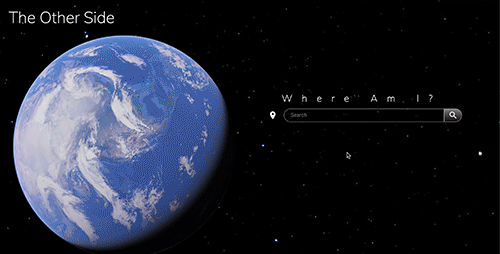

# The Other Side

[](https://opensource.org/licenses/MIT)

Have you ever wondered where you’d land if you dug a hole to the other side of the world? The Other Side will give you the answer.

## User Story

```
AS a curious explorer
WHEN I use the OtherSide
I WANT to know what the opposite side of the world from my current location looks like because of the lack of overseas travel in the moment.
```

```
 antLat = x * -1;
  if (lon >= 0) {
    antLon = y - 180;
  } else if (lon < 0) {
    antLon = y + 180;
  }
```

### Demo


Search any location on Earth and find the antipodal location

### Responsive Design


### Geolocation


Geolocation available

### Errors


If you land in an unavailable location, you will be redirected to Disney World

### And sometimes you won't hit land


## Deployed Application URL

[The Other Side](https://ssharmin0029.github.io/project1/index.html)

## Description

When you open the app, you’ll be given the option of using your current geolocation or searching for a specific location. After choosing where to start, a map hosted by Google Maps will be generated on the screen as well as general information such as the time, the temperature, the name of the country of your current location, the flag of the country, the capital city, the primary currency, the language spoken in that country, the population number and the other countries bordering the country searched. Afterwards you are shown a button to show you the Other Side. When clicked, this button will take to the antipodal coordinates, or the exact diametrically opposite of the searched coordinates. We had to use specific mathematical equations in order to calculate the latitude and longitude for the antipodal location. You are provided the same type of information as the searched country as well.

## Instructions

API keys are temporarily available. In the future, you will need to clone the repo and install your own API keys in the config.js file. For the time being, the application will run and the config file will include temporary keys for use. In the future, the config file will be formatted for the user to replace the keys with their own. Links to API documentation will be available within the config file.

## Navigating the Repository

Upon opening the repository, you will find index.html, readme.md and a folder named assets.

- assets
  - css
    - style.css for mobile
    - 768.css for tablet
    - 992.css for desktop
  - js
    - script.js
    - config.js
  - images
    - images used in app
  - readme
    - images and gifs used in readme.md

### Lighthouse Report


### Made with...

- <a href="https://developers.google.com/maps/documentation/javascript/overview">Google Maps JavaScript API</a>
- <a href="https://developers.google.com/maps/documentation/geocoding/overview#geocoding-requests">Google Geocoding Service</a>
- <a href="https://onwater.io/">onWater API</a>
- <a href="https://restcountries.eu/">Rest Countries API</a>
- <a href="https://timezonedb.com/references/get-time-zone">Timezonedb API</a>
- <a href="https://openweathermap.org/api">Open Weather Map API</a>
- <a href="https://material.io/develop/web">Materialize CSS Framework</a>
- <a href="https://materializecss.com/icons.html">Materialize Icons</a>

Copyright (c) [2021] [Jonathan David, Sabrina Sharmin, Taylor Leong, Xiaotong (Grace) Yang]
